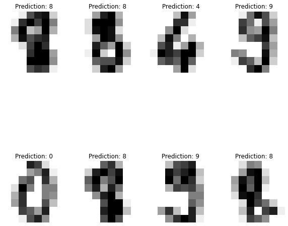

# Recognizing digits with Layer

[](https://app.layer.ai/layer/recognizing-digits) [](https://colab.research.google.com/github/layerai/examples/blob/main/recognizing-digits/recognizing-digits.ipynb) [](https://github.com/layerai/examples/tree/main/recognizing-digits)

### How to use 
Ensure that you are using the latest version of Layer.

```
!pip install --upgrade layer-sdk 
```
You can fetch the trained model and start making predictions from it right away.

```python
import layer
from sklearn import datasets
from sklearn.model_selection import train_test_split
import matplotlib.pyplot as plt
digits = datasets.load_digits()
n_samples = len(digits.images)
data = digits.images.reshape((n_samples, -1))
X_train, X_test, y_train, y_test = train_test_split(
        data, digits.target, test_size=0.5, shuffle=False
    )
model = layer.get_model('layer/recognizing-digits/models/digit-recognizer').get_train()
predicted = model.predict(X_test)
_, axes = plt.subplots(nrows=2, ncols=4, figsize=(10, 10))
for ax, image, prediction in zip(axes.flat, X_test, predicted):
    ax.set_axis_off()
    image = image.reshape(8, 8)
    ax.imshow(image, cmap=plt.cm.gray_r, interpolation="nearest")
    ax.set_title(f"Prediction: {prediction}")
```

## Model
We train a [Support Vector Machine](https://scikit-learn.org/stable/modules/generated/sklearn.svm.SVC.html) model to train a model that predicts 
digits from images.
https://app.layer.ai/layer/recognizing-digits/